# Qhatulab Backend API

<div align="center">


[](https://railway.app)


*Sistema de emparejamiento laboral inclusivo impulsado por IA*

</div>

## 📋 Índice
- [Descripción General](#-descripción-general)
- [Sistema de IA](#-sistema-de-ia)
- [Características](#-características)
- [Requisitos Previos](#-requisitos-previos)
- [Instalación](#-instalación)
- [Configuración](#-configuración)
- [Uso](#-uso)
- [API Endpoints](#-api-endpoints)
- [Tecnologías](#-tecnologías)
- [Equipo](#-equipo)

## 🎯 Descripción General

Qhatulab es una API de emparejamiento inteligente que utiliza IA para conectar personas con discapacidad con oportunidades laborales adecuadas. El sistema analiza múltiples factores como el tipo de discapacidad, habilidades, experiencia y preferencias laborales para proporcionar recomendaciones precisas y relevantes.

## 🧠 Sistema de IA

### Arquitectura del Sistema de Emparejamiento

El sistema utiliza un enfoque basado en IA que evalúa:

1. **Compatibilidad de Perfil**
   - Tipo de discapacidad vs adaptaciones disponibles
   - Habilidades requeridas vs disponibles
   - Experiencia y educación
   - Modalidad y tipo de contrato
   - Ubicación y accesibilidad

2. **Sistema de Puntuación**
```javascript
Score = {
  Disability_Match: 30%,    // Compatibilidad de discapacidad y adaptaciones
  Skills_Match: 25%,        // Coincidencia de habilidades
  Experience_Match: 20%,    // Experiencia relevante
  Location_Match: 15%,      // Compatibilidad de ubicación
  Preferences_Match: 10%    // Preferencias laborales
}
```

### Flujo de Emparejamiento

```mermaid
graph LR
A[Perfil Candidato] --> B[Análisis IA]
C[Oferta Laboral] --> B
B --> D[Cálculo Compatibilidad]
D --> E[Recomendaciones]
```



### Tipos de Discapacidad Cubiertos

| Tipo | Adaptaciones | Consideraciones |
|------|--------------|-----------------|
| Física | ✓ | Accesibilidad física, herramientas adaptativas |
| Visual | ✓ | Software adaptativo, lectores de pantalla |
| Auditiva | ✓ | Comunicación visual, intérpretes |
| Intelectual | ✓ | Instrucciones claras, supervisión adecuada |
| Psicosocial | ✓ | Ambiente laboral adaptado |

## ✨ Características

- 🤖 Sistema de emparejamiento basado en IA (Llama 2)
- 👥 Perfiles detallados de candidatos
- 💼 Gestión de ofertas laborales
- 🎯 Recomendaciones personalizadas
- ⚡ Respuestas en tiempo real
- 📊 Análisis de compatibilidad detallado

## 📋 Requisitos Previos

- Node.js >= 14.0.0
- MongoDB >= 4.4
- Cuenta en Replicate
- Git

## 🚀 Instalación

```bash
# Clonar el repositorio
git clone https://github.com/AnthonyGit1/qhatulab-backend.git

# Entrar al directorio
cd qhatulab-backend

# Instalar dependencias
npm install
```

## ⚙️ Configuración

1. Crear archivo `.env`:

```env
PORT=3000
MONGODB_URI=mongodb://localhost:27017/inclusion_laboral
REPLICATE_API_TOKEN=tu_token_de_replicate
```

2. Iniciar servicios:
```bash
# MongoDB
mongod

# Servidor de desarrollo
npm run dev
```

## 🛣️ API Endpoints

### Candidatos

```http
POST /api/candidates
GET /api/candidates
GET /api/candidates/:id
PUT /api/candidates/:id

Request Body (POST):
{
    "datosPersonales": {
        "nombres": "String",
        "apellidos": "String",
        "edad": Number,
        "ubicacion": {
            "region": "String",
            "provincia": "String",
            "distrito": "String"
        },
        "email": "String",
        "telefono": "String",
        "tipoDiscapacidad": "String"
    },
    "experiencia": [{
        "area": "String",
        "años": Number
    }],
    "educacion": {
        "nivel": "String"
    },
    "habilidades": ["String"],
    "preferenciasLaborales": {
        "modalidad": "String",
        "tipoContrato": "String",
        "areasInteres": ["String"],
        "expectativaSalarial": "String"
    }
}
```

### Trabajos

```http
POST /api/jobs
GET /api/jobs
GET /api/jobs/:id
PUT /api/jobs/:id

Request Body (POST):
{
    "titulo": "String",
    "empresa": {
        "nombre": "String",
        "descripcion": "String"
    },
    "descripcion": "String",
    "requisitos": {
        "habilidades": ["String"],
        "educacion": {
            "nivel": "String"
        },
        "experienciaMinima": Number,
        "tiposDiscapacidadAceptados": ["String"]
    },
    "condicionesLaborales": {
        "modalidad": "String",
        "tipoContrato": "String",
        "ubicacion": {
            "region": "String",
            "provincia": "String",
            "distrito": "String"
        },
        "rangoSalarial": "String"
    },
    "accesibilidad": {
        "tieneAdaptaciones": Boolean,
        "descripcionAdaptaciones": "String"
    }
}
```

### Matching

```http
GET /api/match/candidate/:candidateId
GET /api/match/job/:jobId

Response:
{
    "success": true,
    "count": Number,
    "data": [{
        "job/candidate": Object,
        "compatibilityScore": Number,
        "analysis": {
            "score": Number,
            "razones_match": [String],
            "consideraciones": [String],
            "sugerencias_adaptacion": [String]
        }
    }]
}
```

## 🛠️ Tecnologías

- **Backend**: Express.js
- **Base de Datos**: MongoDB con Mongoose
- **IA**: Replicate (Llama 2)
- **Documentación**: OpenAPI/Swagger

## 👥 Equipo SeedMinds

<div align="center">

| | | |
|:---:|:---:|:---:|
|  |  |  |
| **Anthony Rosas** | **Jaci Lucas** | **Joshelyn Riveros** |
| Backend & IA | Frontend & UX | Contenido & Testing |

</div>

---
<div align="center">

Desarrollado con ❤️ por SeedMinds

</div>